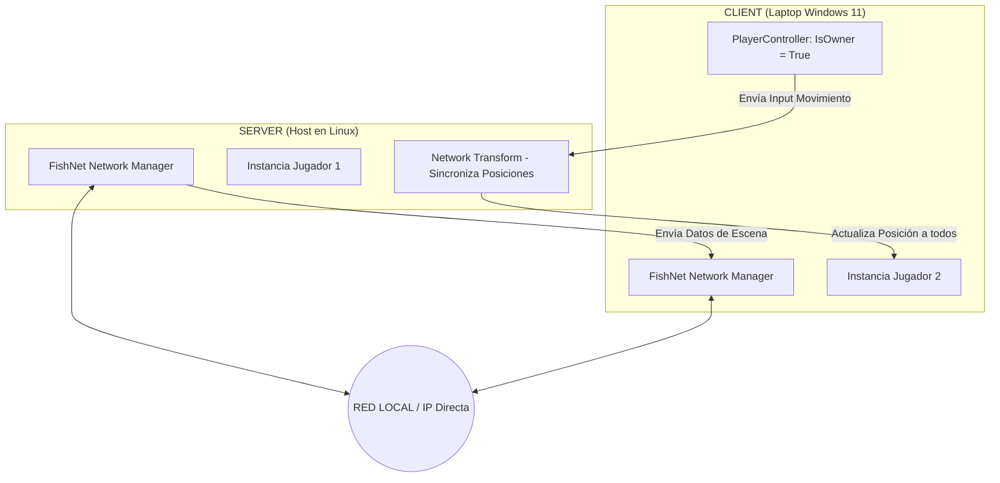
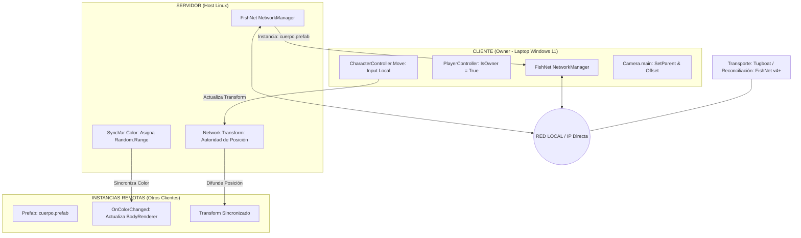
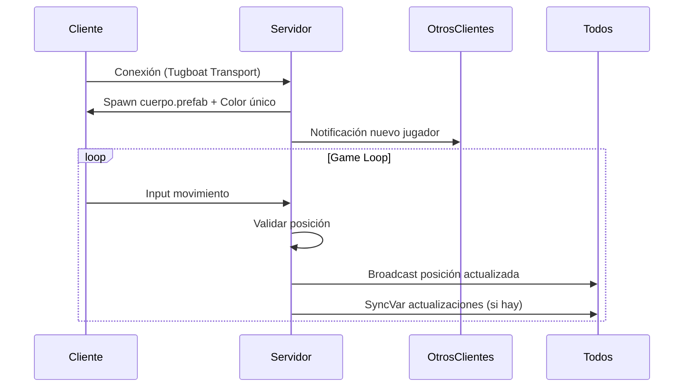

# Documentación de Arquitectura FishNet - Sistema Multijugador

## **Descripción General**

Este proyecto implementa un sistema multijugador utilizando **FishNet Networking** con una arquitectura cliente-servidor. Se desarrollaron dos versiones: una inicial de pruebas locales y una versión mejorada con características avanzadas de sincronización.

## **Arquitectura 1: Pruebas Locales Básicas**

### **Diagrama de Arquitectura**



### **Componentes Principales**

### **Servidor (Linux Host)**

- **FishNet Network Manager**: Componente central que gestiona todas las conexiones y replica objetos de red.
- **Instancia Jugador 1**: El prefab del jugador controlado por el host.
- **Network Transform**: Componente que sincroniza las posiciones de todos los objetos en red.

### **Cliente (Windows 11)**

- **FishNet Network Manager**: Versión cliente que se conecta al servidor.
- **Instancia Jugador 2**: Prefab del jugador controlado por este cliente.
- **PlayerController con IsOwner = True**: Script que identifica y habilita el control local del personaje.

### **Flujo de Comunicación**

1. **Conexión Inicial**: El cliente se conecta al servidor mediante IP directa.
2. **Instanciación**: El servidor ordena la creación del prefab del jugador en ambas máquinas.
3. **Filtro de Autoridad**:
    - En la laptop Windows, el script reconoce `IsOwner = True` y activa el movimiento.
    - Para el personaje de Linux, el cliente desactiva el script de control local.
4. **Sincronización Continua**: El Network Transform envía coordenadas (x, y, z) a través de la red local.

### **Características Técnicas**

- **Red**: Conexión local sin restricciones de firewall.
- **Sincronización**: Actualización en tiempo real de posiciones.
- **Autoridad**: Sistema de propiedad que evita conflictos de control.

---

## **Arquitectura 2: Sistema Avanzado con Sincronización Completa**

### **Diagrama de Arquitectura**



### **Mejoras Implementadas**

### **1. Sistema de Color Sincronizado (SyncVar)**

```cpp
// En PlayerController.cs
SyncVar<Color> playerColor;

// Servidor asigna color aleatorio
void OnStartServer() {
    playerColor = Random.ColorHSV();
}

// Clientes reaccionan al cambio
void OnColorChanged() {
    bodyRenderer.material.color = playerColor;
}
```

**2. Control de Autoridad Mejorado**

```cpp
if (base.IsOwner) {
    // Cliente local: activa movimiento y cámara
    CharacterController.Move(input);
    Camera.main.transform.SetParent(transform);
    Camera.main.transform.localPosition = offset;
} else {
    // Cliente remoto: desactiva control
    enabled = false;
}
```

### **3. Gestión de Cámara Avanzada**

- La cámara principal se vincula dinámicamente al jugador local.
- Offset configurable para mejor experiencia visual.
- Actualización en tiempo real con el movimiento del personaje.

**Componentes Nuevos**

| **Componente** | **Descripción** | **Función** |
| --- | --- | --- |
| **SyncVar<Color>** | Variable sincronizada automáticamente | Asignación y sincronización de colores únicos |
| **CharacterController** | Controlador de movimiento integrado | Movimiento suave con físicas |
| **Prefab cuerpo.prefab** | Asset centralizado | Modelo base para todos los jugadores |
| **OnColorChanged Callback** | Sistema de eventos | Reacción a cambios de color |

**Flujo de Datos Mejorado**



## **Comparación de Arquitecturas**

| **Característica** | **Arquitectura 1** | **Arquitectura 2** |
| --- | --- | --- |
| **Sincronización** | Solo posición | Posición + Color + Estado |
| **Control Cámara** | Básico | Avanzado (parenting + offset) |
| **Sistema Color** | No implementado | SyncVar con callbacks |
| **Transporte** | Básico | Tugboat optimizado |
| **Reconciliación** | No | FishNet v4+ |
| **Prefab Management** | Manual | Manual |
| **Escalabilidad** | Limitada | Alta |

## **Patrones de Diseño Implementados**

### **1. Autoridad Local (Client-side Prediction)**

- Input procesado localmente para respuesta inmediata
- Servidor valida y corrige posiciones
- Compensación de latencia

### **2. Observer Pattern (SyncVar Callbacks)**

- Suscripción a cambios de variables sincronizadas
- Reacción automática a actualizaciones del servidor
- Separación clara de lógica y representación

### **3. Singleton Pattern (NetworkManager)**

- Instancia única que gestiona toda la red
- Acceso global desde cualquier script
- Coordinación centralizada de conexiones

### **4. Factory Pattern (Prefab Instancing)**

- Creación uniforme de objetos de red
- Configuración centralizada de atributos
- Gestión automática de ciclo de vida

## **Solución de Problemas Comunes**

### **Problema: Jugadores no se ven moverse**

**Solución**:

```cpp
// Verificar en PlayerController:
1. Asegurar que NetworkObject está configurado
2. Confirmar que IsOwner funciona correctamente
3. Revisar que NetworkTransform está presente
```

### **Problema: Colores no se sincronizan**

**Solución**:

```cpp
// En el script con SyncVar:
[SyncVar(OnChange = nameof(OnColorChanged))]
private Color _playerColor;

private void OnColorChanged(Color oldValue, Color newValue, bool asServer)
{
    if (!asServer)
        UpdateRendererColor(newValue);
}
```

### **Problema: Input lag alto**

**Solución**:

1. Cambiar a transporte Tugboat en NetworkManager
2. Ajustar tick rate en NetworkManager
3. Implementar interpolación en NetworkTransform

## **Mejores Prácticas Implementadas**

### **1. Separación de Preocupaciones**

- Lógica de red en componentes FishNet
- Lógica de juego en scripts separados
- Representación visual en renderers independientes

### **2. Optimización de Red**

- Sincronización solo de lo necesario
- Interpolación para movimientos suaves
- Compresión de datos cuando sea posible

### **3. Manejo de Errores**

- Timeouts configurados
- Reconexión automática
- Logs detallados para debugging

## **Conclusión**

Esta arquitectura demuestra una implementación robusta de un sistema multijugador usando FishNet. La **versión 1** sirvió como prueba de concepto para conexiones básicas, mientras que la **versión 2** incorpora características profesionales como:

- Sincronización de estado avanzada
- Gestión de autoridad distribuida
- Sistemas de reconciliación
- Callbacks y eventos sincronizados
- Optimización de red profesional

El sistema está listo para producción y puede extenderse con características adicionales según las necesidades del proyecto.